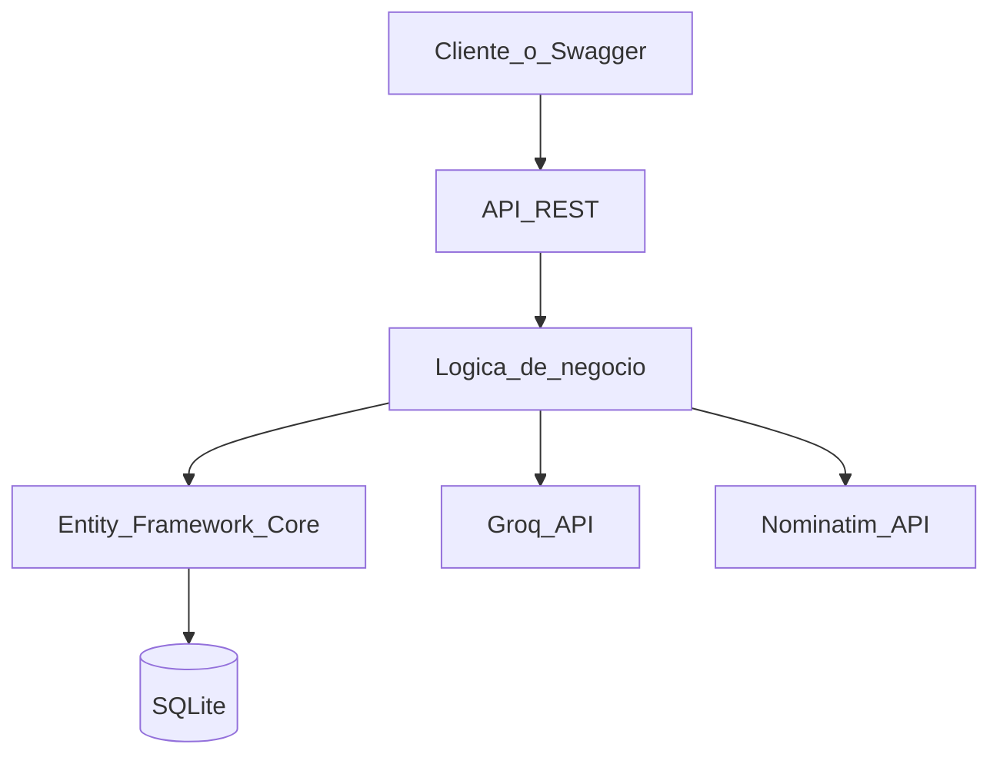

# Sistema Inteligente de Reportes Ciudadanos con IA

API REST desarrollada en ASP.NET Core 8 para registrar, administrar y analizar
problemáticas urbanas. El proyecto está alineado con el **ODS 11: Ciudades y
Comunidades Sostenibles**.

Los ciudadanos pueden reportar baches, fallas de alumbrado, acumulación de
basuras, daños en zonas verdes y afectaciones al espacio público. Groq clasifica
los reportes, asigna su prioridad, resume el incidente y recomienda la entidad
que debe atenderlo.

## Tecnologías

- ASP.NET Core Web API y Swagger/OpenAPI
- Entity Framework Core 8
- SQLite
- Groq Chat Completions API
- OpenStreetMap Nominatim mediante `HttpClient`

## Arquitectura



La solución mantiene separados los controladores, DTOs, modelos, acceso a datos
y servicios externos. `Reporte` tiene una relación uno a uno con `AnalisisIA`.

## Requisitos

- .NET SDK 8
- Una API key de Groq para ejecutar el análisis
- Acceso a internet para Groq y la geocodificación

La geocodificación no bloquea la creación: si Nominatim no está disponible, el
reporte se guarda sin coordenadas.

## Configuración

Desde la raíz del repositorio, copie el archivo de ejemplo:

```powershell
Copy-Item .env.example .env
```

Abra `.env` y configure su clave:

```dotenv
GROQ_API_KEY=gsk_su_clave_de_groq
```

El archivo `.env` está ignorado por Git para evitar publicar la clave. La
aplicación lo busca desde el directorio actual y sus carpetas superiores, por lo
que funciona tanto desde la raíz como desde el proyecto de la API. Una variable
de entorno del sistema con el mismo nombre tiene prioridad sobre `.env`.

La configuración por defecto usa:

- Modelo Groq: `llama-3.3-70b-versatile`
- SQLite: `Data Source=reportes.db`
- Nominatim: `https://nominatim.openstreetmap.org`

## Ejecución

```powershell
dotnet restore
dotnet run --project .\src\ReportesCiudadanos.Api
```

## Abrir Swagger y probar la API

Cuando la terminal muestre `Now listening on: http://localhost:5233`, abra en
el navegador:

**http://localhost:5233**

Esa dirección abre directamente Swagger UI. Allí puede desplegar cualquier
endpoint, pulsar **Try it out**, completar los datos y pulsar **Execute**.

El documento OpenAPI en formato JSON está disponible en:

**http://localhost:5233/swagger/v1/swagger.json**

No cierre la terminal mientras hace las pruebas. Para detener la API, presione
`Ctrl+C`. La base de datos `reportes.db` se crea automáticamente durante el
primer inicio.

## Organización del repositorio

```text
proyecto-final-diplomado-.NET/
├── ReportesCiudadanos.sln
├── src/ReportesCiudadanos.Api/
├── GUIAS/
│   ├── taller_avances.md
│   └── Taller de definición del Proyecto Final.docx
├── algoritmo-de-luhn/
├── .env.example
└── README.md
```

La solución y el código están directamente en la raíz. Los documentos de
planteamiento y definición se conservan en `GUIAS`.

## Endpoints

| Método | Ruta | Descripción |
|---|---|---|
| GET | `/api/reportes` | Lista reportes y aplica filtros |
| GET | `/api/reportes/{id}` | Consulta un reporte y su análisis |
| POST | `/api/reportes` | Crea y geocodifica un reporte |
| PUT | `/api/reportes/{id}` | Actualiza el reporte |
| DELETE | `/api/reportes/{id}` | Elimina el reporte y su análisis |
| POST | `/api/reportes/{id}/analizar` | Ejecuta o repite el análisis con Groq |

Filtros disponibles para `GET /api/reportes`:

```http
GET /api/reportes?categoria=Alumbrado
GET /api/reportes?estado=Pendiente
GET /api/reportes?prioridad=Alta
GET /api/reportes?fechaInicio=2026-08-01&fechaFin=2026-08-31T23:59:59
```

Los estados válidos son `Pendiente`, `En proceso`, `Resuelto` y
`Pendiente de análisis`. Las prioridades producidas por la IA son `Alta`,
`Media` y `Baja`.

## Ejemplo de uso

Crear un reporte:

```http
POST /api/reportes
Content-Type: application/json

{
  "titulo": "Alumbrado público dañado",
  "descripcion": "El alumbrado no funciona desde hace dos semanas y la zona queda oscura.",
  "direccion": "Calle 15 #20-35, Barranquilla, Colombia"
}
```

La respuesta `201 Created` contiene fecha, estado y, cuando Nominatim encuentra
la dirección, latitud, longitud y ubicación normalizada.

Analizar el reporte:

```http
POST /api/reportes/1/analizar
```

Respuesta esperada:

```json
{
  "categoria": "Alumbrado público",
  "prioridad": "Alta",
  "resumen": "Falla prolongada del alumbrado público en una zona residencial.",
  "recomendacion": "Remitir el caso a la Secretaría de Infraestructura.",
  "fechaAnalisis": "2026-08-03T15:30:00Z"
}
```

El resultado queda persistido y aparece al consultar el reporte. Un nuevo
análisis actualiza el registro existente. Si Groq falla o la clave no está
configurada, la API responde `502`, conserva el reporte con estado
`Pendiente de análisis` y permite reintentar el mismo endpoint.

Actualizar un reporte:

```http
PUT /api/reportes/1
Content-Type: application/json

{
  "titulo": "Alumbrado público dañado",
  "descripcion": "El alumbrado no funciona desde hace dos semanas y la zona queda oscura.",
  "direccion": "Calle 15 #20-35, Barranquilla, Colombia",
  "estado": "En proceso"
}
```

## Modelo de datos

`Reporte` administra título, descripción, dirección, fecha de registro, estado,
categoría, prioridad y geolocalización. `AnalisisIA` almacena el resumen,
recomendación y fecha del análisis asociados al reporte mediante `ReporteId`.
La eliminación es en cascada.

## Guion de demostración

1. Ejecutar el proyecto y abrir Swagger.
2. Crear un reporte con `POST /api/reportes`.
3. Consultarlo con `GET /api/reportes/{id}` y mostrar su geocodificación.
4. Analizarlo con `POST /api/reportes/{id}/analizar`.
5. Consultar por categoría, prioridad o estado.
6. Actualizar su estado y eliminarlo.

## Distribución inicial del equipo

| Rol | Primera responsabilidad |
|---|---|
| Backend / TL | Arquitectura, solución y endpoints |
| API / IA | Integración y pruebas de Groq |
| BD / DTOs | Modelos, validaciones y SQLite |
| Docs / QA | README, Swagger y casos de prueba |
